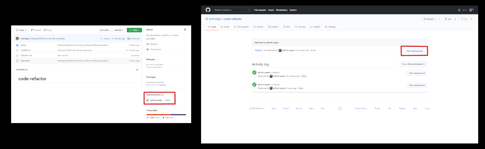

# [Code-Refactor](https://bcbridges.github.io/code-refactor/) Website

## Description of Project

This code was refactored to provide clarity and visual ease for current and future developers of the site. The following elements were refactored.

### index.html

- Non-semantic elements were changed to semantic.
- Alternative text was added to each image to enhance screen reader's experience.
- Three classes were changed to ids to allow link features in the navigation bar to perform properly.

### style.css

- Duplicate rulesets were merged to shorted the length of code without changing the user interface.
- Comments were added to provide a brief description of merged elements.
- Classes that were changed to ids had their respective ruleset selectors updated to reflect properly.

## Installation and Access

There is no required software installation necessary to access the code or GitHub published webpage. To access the webpage, either click the 'Code-Refactor' link at the top of this readme or go to this link https://bcbridges.github.io/code-refactor/. To manually access the webpage from the repository home page, click the 'github-pages' under the 'Environments' tab (see image below).

The index.html can be accessed [here](./index.html), & the style.css can be accessed [here](./assets/css/style.css).

## License

Note: This copyright is not legally binding and is only for practice purposes.

Copyright (C) 2021 Brice Bridges - the full license can be viewed [here](./LICENSE.txt)
